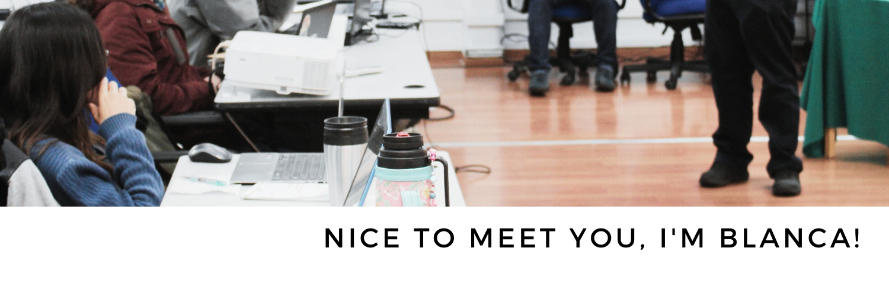

# ✨👋 &nbsp;&nbsp;Welcome to my Github!

🪐 I'm a physicist specialized in astrophysics who has ventured into the world of professional development, data science and technology. 

🌑 From my academic background, I acquired knowledge and became familiar with C++, R and Bash in order to perform numerical simulations of supermassive black holes in the center of galaxies.

👩‍💻 I have experience working with Python on data analysis projects using Pandas, Numpy, Plotly, and Jupyter. 

🕸 I have worked as a Web Developer where I used HTML, CSS, Bootstrap, Go, Angular and TypeScrit.

✏️ I am a self-taught developer and data scientist. Therefore, I am currently enrolled in the Data Science career at <a href ="https://platzi.com/p/Blancamse/">Platzi</a>.

🗣 I speak Spanish and English.
 
🧍‍♀️ My pronouns are she / hers.

## 💻 &nbsp;&nbsp; Technologies I have used:

    
    
    
    
    
    
    
    
    
    
    
    
    
    
    
     
    
    
    
    
    

## 💬 &nbsp;&nbsp; You can know more about me at:

* 👋 <a href="https://blancamorillo.com/en/about">My Website</a> 

* 👩‍💼  <a href="https://www.linkedin.com/in/blancamorillo/">Linkedin</a>

* 🐥  <a href="https://twitter.com/BlancaMorilloS">Twitter</a>

* ✉️ <a href="mailto:blanca@blancamorillo.com">Email</a>
